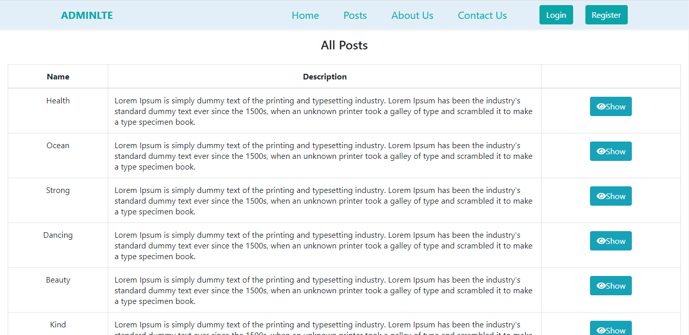

# AdminLTE Project
AdminLTE website provides an efficient way to find posts between users and guests.User can create their account and they can also post posts.The guest can view post details.Admin can manage the users and posts.
## Requirements

- PHP 8
- Apache 
- MySQL 8
- Composer 2.1.6
- Laravel 8

## Installation

Please check the official laravel installation guide for server requirements before you start.
[Official Documentation](https://laravel.com/docs/8.x)

Clone the repository
```
git clone https://github.com/KyiMyatNoeSoe7/AdminLTE.git
```
Switch to the repo folder
```
cd AdminLTE
```
Install all the dependencies using composer
```
composer install
```
Copy the example env file and make the required configuration changes in the .env file
```
cp .env.example .env
```
Generate a new application key
```
php artisan key:generate
```
Run the database migrations (Set the database connection in .env before migrating)
```
php artisan migrate
```
Run the database seeder 
```
php artisan db:seed
```
Start the local development server
```
php artisan serve
```
You can now access the server at http://localhost:8000 and login using this email and password for admin.

```
Email : superadmin@gmail.com
Password : 12345678
```

## Sample Post data
- [csv file for posts data ](https://github.com/KyiMyatNoeSoe7/AdminLTE/blob/c60028244e391a2523523da7bce9164f768d89ba/docs/export-posts.csv)


## Features

- [Admin](#Admin)
- [User](#User)
- [Frontend](#Frontend)


## Admin
Admin can manage the users, and posts. Admin part include `User Authentication`, `Role and Permission between admin and user`.

## Admin Dashboard


## User
User can edit profile and can post posts. User part include `edit profile`, `create posts`, `edit posts`, `delete posts`.

## User Dashboard


## Frontend

The guest can view posts and post details.



## Top Page


    
